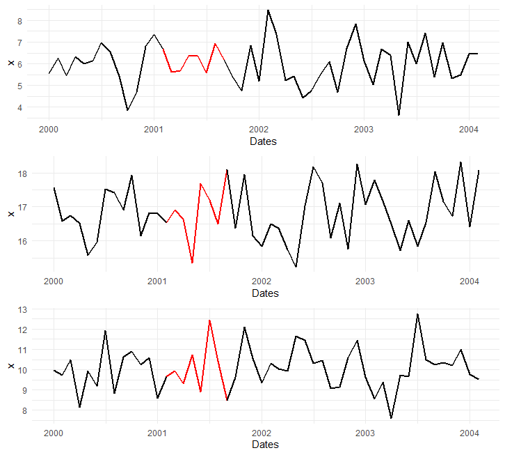

imputeSTS
==========

The `imputeSTS` package provides a method for imputation of missing values in homoscedastic Seasonal Time Series. based on STL-Loess Descomposition (Local Non Paramétric Regression) and Monte Carlo simulation. The package also has functions for visualization.

Installation
----------------

Install the stable version from [CRAN](https://CRAN.R-project.org/package=imputeSTS):

``` r 
install.packages("imputeSTS")
```

or install the development version from [Github](https://github.com/CristianPachacama/imputeSTS):

``` r
# install.packages("devtools")
devtools::install_github("CristianPachacama/imputeSTS")
```

Functions
----------------
impute.STS() 
----------------
This function implement the imputation method, on a object of class `ts` (time serie with missing values), and return a list with the time serie cleaned. 


plot.STS()
----------------
This function generates a plot with the original and reconstructed time series, contained in a object of class `STS`.


